# 🧬 mpxv-analyzer

An end-to-end **mpxv (Monkeypox virus) sequencing analysis pipeline** supporting both:

- 🧪 Illumina (short-read)
- 🔬 Nanopore (long-read)

This pipeline performs QC, consensus generation, coverage analysis, clade assignment, mutation profiling, and phylogenetic analysis using the integrated tools and Nextflow workflows.

---

## 🔄 Workflow Diagram

```mermaid
  
flowchart LR
    A[Input Samplesheet] --> B["nf-qcflow QC"]

    B --> C1[Illumina Reads]
    B --> C2[Nanopore Reads]

    C1 --> D1["ARTIC Illumina Pipeline"]
    C2 --> D2[Prepare Barcode Structure]
    D2 --> D3["ARTIC Nanopore Pipeline"]

    D1 --> E[Consensus FASTA]
    D3 --> E

    E --> F["nf-covflow Coverage"]

    F --> G[Summary Report Directory]

    G --> H[FASTA Stats]
    H --> I[Filter by Completeness]

    I --> J[Nextclade]
    I --> K[Squirrel]

    J --> L[Clade Assignment]
    K --> M["Phylogeny + SNP QC"]

    L --> N[Final Report]
    M --> N
```


## Usage
- Create and activate required conda environment if it is not available
  ```
  conda env create -f path_to_downloaded/mpxv-analyzer/env/environment.yml
  conda activate mpxv-analyzer-env
  ```

