# 🧬 mpxv-analyzer

An end-to-end **mpxv (Monkeypox virus) sequencing analysis pipeline** supporting both:

- 🧪 Illumina (short-read)
- 🔬 Nanopore (long-read)

This pipeline performs QC, consensus generation, coverage analysis, clade assignment, mutation profiling, and phylogenetic analysis using the integrated tools and Nextflow workflows.

---

## 🔄 Workflow Diagram

```mermaid
  
flowchart LR
    A[Input Samplesheet] --> B["nf-qcflow QC"]

    B --> C1[Illumina Reads]
    B --> C2[Nanopore Reads]

    C1 --> D1["ARTIC Illumina Pipeline"]
    C2 --> D2[Prepare Barcode Structure]
    D2 --> D3["ARTIC Nanopore Pipeline"]

    D1 --> E[Consensus FASTA]
    D3 --> E

    E --> F["nf-covflow Coverage"]

    F --> G[Summary Report Directory]

    G --> H[FASTA Stats]
    H --> I[Filter by Completeness]

    I --> J[Nextclade]
    I --> K[Squirrel]

    J --> L[Clade Assignment]
    K --> M["Phylogeny + SNP QC"]

    L --> N[Final Report]
    M --> N
```


## Usage
- Create and activate required conda environment if it is not available
  ```
  conda env create -f path_to_downloaded/mpxv-analyzer/env/environment.yml
  conda activate mpxv-analyzer-env
  ```
### Run pipeine without Slurm configuration

#### For Illumina data
```
bash scripts/mpxv_illumina_pipeline.sh --help
  scripts/mpxv_illumina_pipeline.sh - mpox Illumina analysis pipeline
  
  Version: mpox-analyzer: 0.1.1
  Author: Xiaoli Dong, ProvLab - South, Calgary, AB, Canada
  
  USAGE:
   bash scripts/mpxv_illumina_pipeline.sh <samplesheet.csv> <results_dir> [options]
  
  REQUIRED:
    samplesheet.csv       Input samplesheet (CSV)
    results_dir           Output directory for pipeline results
  
  Options:
    -h, --help
    -v, --version
    --qcflow-config FILE   Custom qcflow config
    --completeness FLOAT     Consensus completeness cutoff (default: 0.8)
  
  EXAMPLES:
    bash scripts/mpxv_illumina_pipeline.sh samplesheet.csv results
  
    bash scripts/mpxv_illumina_pipeline.sh samplesheet.csv results       --qcflow-config qcflow.config
  
  CHECK HELP WITHOUT SUBMITTING:
    bash scripts/mpxv_illumina_pipeline.sh --help
  
  CHECK VERSION WITHOUT SUBMITTING:
      bash scripts/mpxv_illumina_pipeline.sh --version
```
#### For Nanopore data
```
bash scripts/mpxv_nanopore_pipeline.sh --help
  scripts/mpxv_nanopore_pipeline.sh - MPXV Nanopore analysis pipeline
  
  Version: mpox-analyzer: 0.1.1
  Author: Xiaoli Dong, ProvLab - South, Calgary, AB, Canada
  
  USAGE:
   bash scripts/mpxv_nanopore_pipeline.sh <samplesheet.csv> <results_dir> [options]
  
  REQUIRED:
    samplesheet.csv       Input samplesheet (CSV)
    results_dir           Output directory for pipeline results
  
  Options:
    -h, --help
    -v, --version
    --qcflow-config FILE   Custom qcflow config
    --completeness FLOAT     Consensus completeness cutoff (default: 0.8)
  
  EXAMPLES:
    sh scripts/mpxv_nanopore_pipeline.sh samplesheet.csv results
  
    sh scripts/mpxv_nanopore_pipeline.sh samplesheet.csv results       --qcflow-config qcflow.config
  
  CHECK HELP WITHOUT SUBMITTING:
    bash scripts/mpxv_nanopore_pipeline.sh --help
  
  CHECK VERSION WITHOUT SUBMITTING:
      bash scripts/mpxv_nanopore_pipeline.sh --version
```
### Run pipelines with Slurm configuration
#### For illumina data
```
bash scripts/sbatch_submit_illumina.sh --help
  MPXV Illumina SLURM submission script
  
  USAGE:
   sbatch scripts/sbatch_submit_illumina.sh <samplesheet.csv> <results_dir> [options]
  
  REQUIRED:
    samplesheet.csv       Input samplesheet (CSV)
    results_dir           Output directory for pipeline results
  
  OPTIONS:
    --qcflow-config FILE     Custom nf-qcflow config file
    -h, --help               Show this help
  
  EXAMPLES:
    sbatch scripts/sbatch_submit_illumina_deve.sh samplesheet.csv results_dir
  
    sbatch scripts/sbatch_submit_illumina_deve.sh samplesheet.csv results_dir       --qcflow-config qcflow.config
  
  CHECK HELP WITHOUT SUBMITTING:
    bash scripts/sbatch_submit_illumina_deve.sh --help
  
  NOTES:
    • This script must be submitted with sbatch
    • SLURM stdout/stderr will be written to:
        slurm-<jobid>.out
        slurm-<jobid>.err
  
  samplesheet example
      sample,fastq_1,fastq_2,long_fastq
      sid,r1.fastq.gz,r2.fastq.gz,NA
```
#### For nanopore data
```
bash scripts/sbatch_submit_nanopore.sh --help
  MPXV Nanopore SLURM submission script
  
  USAGE:
   sbatch scripts/sbatch_submit_nanopore.sh <samplesheet.csv> <results_dir> [options]
  
  REQUIRED:
    samplesheet.csv       Input samplesheet (CSV)
    results_dir           Output directory for pipeline results
  
  OPTIONS:
    --qcflow-config FILE     Custom nf-qcflow config file
    -h, --help               Show this help
  
  EXAMPLES:
    sbatch scripts/sbatch_submit_nanopore.sh samplesheet.csv results_dir
  
    sbatch scripts/sbatch_submit_nanopore.sh samplesheet.csv results_dir       --qcflow-config qcflow.config
  
  CHECK HELP WITHOUT SUBMITTING:
    bash scripts/sbatch_submit_nanopore.sh --help
  
  NOTES:
    • This script must be submitted with sbatch
    • SLURM stdout/stderr will be written to:
        slurm-<jobid>.out
        slurm-<jobid>.err
  
  samplesheet example
      sample,fastq_1,fastq_2,long_fastq
      sid,NA,NA,long.fastq.gz
```
## Key Output Files

| File | Description |
|------|-------------|
| `summary_report/reads_*.qc_report.csv` | sequence reads per-sample QC metrics |
| `summary_repoort/mpxv_master.tsv` | Master summary combining QC, consensus, coverage, and clade data |
| `summary_repoort/all_consensus.fasta` | conmbined consensus sequence file |
| `summary_report/all_consensus.high_quality.fasta` | Combined consensus sequence file, in which the completeness of the sequences are >= 80% |
`summary_report/plot/*.pdf` | Amplicon and chromosome coverage, depth profile and  visualizations |
| `summary_report/nextclade/nextclade.tsv` | Clade assignments and quality metrics per subgroup |
| `summary_report/all_consensus.stats.tsv` | Consensus coverage and completeness statistics |
| `summary_report/squirrel` | Squirrel clade assignment and phylogenetic analysis output |

